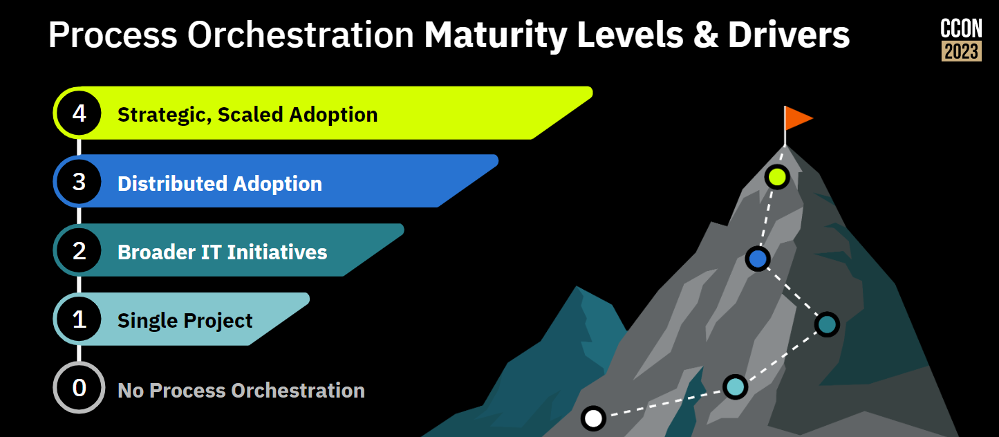

## Getting to level 1

There are some core activities to get from **no process orchestration** to your first **single project**. They might differ depending on the journey you are on.

You might start your process orchestration journey **top down** or **bottom up**, let's quickly look at the differences.

### Top down adoption journeys

In top down journey, some strategic initiative is the driver, typical examples include:

- Digitalization programs
- Cloud inatives
- Goals to increasing automation rates

In those cases, C-suites define goals, which need to be operationalized. Activities to support this and make your first project a success are:

- [Align strategy (Vision)](/docs/advice/poam/vision/strategy-alignment.md): Establish a clear understanding why process orchestration is an important building block to operationalize your organizations strategy. This is typically achieved by workshops, also looking at other industry examples.

- [Secure executive support (Vision)](/docs/advice/poam/vision/executive-support.md): Make sure, important stakeholder understand why process orchestration is an important building brick for the voiced vision. This can be typically catalized by industry examples. Note, that at this stage, you might not need the whole company buying into the vision, just enough support to kick-off your first project(s).

- [Select your first process (Measurement)](/docs/advice/poam/vision/executive-support.md): Every journey has to begin with a first step. This should be a concrete project, where process orchestration can deliver real-value. You should select those first project(s) wisely.

- [Define your success metrics (Measurement)](/):

- [Define and enable the team](/): You need a good team for your first project. This team will need some enablement and might help you scaling process orchestration later on. [Read more...](/).

- [Define your hyperautomation tool stack (Technology)](/): Most organizations already have various tools around integration and automation. You need to understand the role of process orchestration and define the role of Camunda also in contrast to other tools being used. [Read more...](/).

- [Develop the solution (Delivery)](/):

- [Test your solution (Delivery)](/):

- [Life the solution lifecycle (Delivery)](/):

- [Define your development methodology (Delivery)](/):

- [Calculate the business case (Measurement)](/):

### Bottom up adoption journey

Can be driven bottom up or top down
One specific use case might lead to the first process orchestration solution, adopted more broadly in the next steps.
A strategic initiative might also introduce process orchestration, still you should start with a first concrete use case.

The right process
Solving a concrete pain
Generating value and ROI
Relevant
Right-sized
Close to the customer
Starting with an increment

## Getting to level 2

## Getting to level 3

## Getting to level 4
